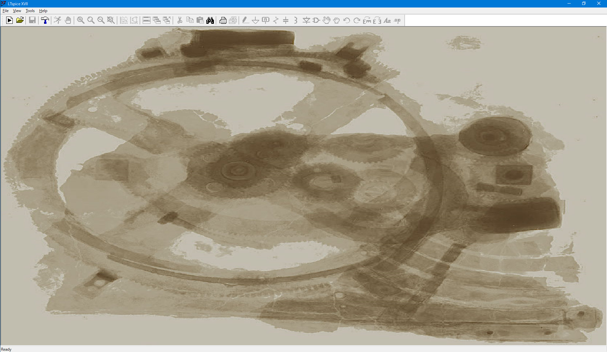

# LTspice® 講座 第1回 LTspice® について

## 1. LTspice® とは
公式サイトより
> 高性能なSpiceシミュレーション・ソフトウェアで、回路図入力、波形ビューワに改善を加え、スイッチング・レギュレータのシミュレーションを容易にするためのモデルを搭載しています。

電子回路がどのように動作するかを実際に画面上で確認ができるソフトウェアです。

[LTspice® 公式サイト](https://www.analog.com/jp/design-center/design-tools-and-calculators/ltspice-simulator.html){:target="_blank"}

## 2. インストール
LTspice® 直リンク

* [windows版](http://ltspice.analog.com/software/LTspiceXVII.exe)
* [Mac版](http://ltspice.analog.com/software/LTspice.dmg) ※ homebrewも可
* homebrewの場合以下を実行  

`$ brew cask install ltspice`
<button class="btn-gradient-3d" data-clipboard-text="brew cask install ltspice"> コピー</button>  

* Linuxの場合はLinux版はないため, wineでwindowsのexeを実行します。

## 3. 部品登録

### 3.1 よく使う素子の登録

LTspiceは, はじめから登録されている部品が少ないため, 以下の2つの部品を自分で登録して使います。

1. NPN トランジスタ 2SC1815
2. PNP トランジスタ 2SA1015

トランジスタとは入力した信号に応じて電流を流したり止めたりする素子です。  
詳しい解説は[こちらへ](https://www.murata.com/ja-jp/campaign/ads/japan/elekids/compo/transistor){:target="_blank"}

#### windowsの場合
`ドキュメント¥LTspiceXVII¥lib¥cmp¥standard.bjt`

#### Macの場合
`~/Library/Application\ Support/LTspice/lib/cmp/standard.bjt`

のファイルに, 以下を追記します。

```
*Low Noise Amp PC=0.4W Ic=0.15A Vcbo=60V Complementary 2SA1015
.model 2SC1815 NPN(Is=2.04E-15 Xti=3 Eg=1.11 Vaf=100 Bf=300 Ne=1.5 Ise=0
+ Vceo=50 Icrating=150m mfg=TOSHIBA
+ Ikf=200m Xtb=1.5 Br=3.377 Nc=2 Isc=0 Ikr=0 Rc=1 Cjc=1p Mjc=.3333
+ Vjc=.75 Fc=.5 Cje=25p Mje=.3333 Vje=.75 Tr=450n Tf=20n Itf=0 Vtf=0 Xtf=0)

.model 2SC1815-GR NPN(Is=2.04E-15 Xti=3 Eg=1.11 Vaf=100 Bf=300 Ne=1.5 Ise=0
+ Vceo=50 Icrating=150m mfg=TOSHIBA
+ Ikf=200m Xtb=1.5 Br=3.377 Nc=2 Isc=0 Ikr=0 Rc=1 Cjc=1p Mjc=.3333
+ Vjc=.75 Fc=.5 Cje=25p Mje=.3333 Vje=.75 Tr=450n Tf=20n Itf=0 Vtf=0 Xtf=0)

.model 2SC1815-Y NPN(Is=2.04E-15 Xti=3 Eg=1.11 Vaf=100 Bf=200 Ne=1.5 Ise=0
+ Vceo=50 Icrating=150m mfg=TOSHIBA
+ Ikf=200m Xtb=1.5 Br=3.377 Nc=2 Isc=0 Ikr=0 Rc=1 Cjc=1p Mjc=.3333
+ Vjc=.75 Fc=.5 Cje=25p Mje=.3333 Vje=.75 Tr=450n Tf=20n Itf=0 Vtf=0 Xtf=0)

*Low Noise Amp PC=0.4W Ic=0.15A Vcbo=50V Complementary 2SC1815
.model 2SA1015 PNP(Is=295.1E-18 Xti=3 Eg=1.11 Vaf=100 Bf=300 Ne=1.5 Ise=0
+ Vceo=50 Icrating=150m mfg=TOSHIBA
+ Ikf=200m Xtb=1.5 Br=10.45 Nc=2 Isc=0 Ikr=0 Rc=15 Cjc=66.2p
+ Mjc=1.054 Vjc=.75 Fc=.5 Cje=5p Mje=.3333 Vje=.75 Tr=10n Tf=1.661n Itf=0 Vtf=0 Xtf=0)

.model 2SA1015-GR PNP(Is=295.1E-18 Xti=3 Eg=1.11 Vaf=100 Bf=300 Ne=1.5 Ise=0
+ Vceo=50 Icrating=150m mfg=TOSHIBA
+ Ikf=200m Xtb=1.5 Br=10.45 Nc=2 Isc=0 Ikr=0 Rc=15 Cjc=66.2p
+ Mjc=1.054 Vjc=.75 Fc=.5 Cje=5p Mje=.3333 Vje=.75 Tr=10n Tf=1.661n Itf=0 Vtf=0 Xtf=0)

.model 2SA1015-Y PNP(Is=295.1E-18 Xti=3 Eg=1.11 Vaf=100 Bf=200 Ne=1.5 Ise=0
+ Vceo=50 Icrating=150m mfg=TOSHIBA
+ Ikf=200m Xtb=1.5 Br=10.45 Nc=2 Isc=0 Ikr=0 Rc=15 Cjc=66.2p
+ Mjc=1.054 Vjc=.75 Fc=.5 Cje=5p Mje=.3333 Vje=.75 Tr=10n Tf=1.661n Itf=0 Vtf=0 Xtf=0)
```
それぞれの部品の詳しい情報は以下のデータシートを参照してください。

[データーシート 2CS1815-GR (秋月電子)](http://akizukidenshi.com/download/2sc1815-gr.pdf){:target="_blank"}  
[データーシート 2CA1015-GR (秋月電子)](http://akizukidenshi.com/download/2sa1015-gr.pdf){:target="_blank"}

## 4. 使い方
起動直後の画面 (windows版)



### 4.1 新規作成
File > New Schematic で, 空の図面ができるため部品を配置していきます。  
※ Macの場合はすでに図面があるため, そのまま部品を置いていきます。

### 4.2 UIの説明


左から

導線 GND ラベル 抵抗 コンデンサ コイル ダイオード その他の素子 ムーブ ドラッグ 戻る 進む 
回転 反転 コメント SPICEコマンド

の順で並んでいる.  
これらを使い部品を配置して, 回路図を作っていきます。

* 導線は素子と素子を結ぶ
* GNDは電子回路の基準電位であり, ここを基準に電圧値が決まる (回路に必ずつけること)
* ラベルは出力電圧Voutなど, 調べたい場所に名前を付けられる
* 抵抗は抵抗器は電流を流れにくくする素子
* コンデンサはコンデンサは電荷を蓄えたり放出したりする素子 (直流は通さない)
* コイルは電流と磁気を互いに作用させて色々なはたらきをする素子
* ダイオードは電流の流れを一方通行にする素子
* その他の素子は上記以外の素子が選択できる
* ムーブは素子の場所を動かすことができる
* ドラッグは子の場所を動かすことができる
* 戻るは一つ前の状態に戻ることができる
* 進むは一つ先の状態に進むことができる
* 回転は素子を回転することができる
* 反転は素子を反転することができる
* コメントはコメントを書き込める
* SPICEコマンドは解析に必要な事項を書き込む

[2回目へ](2.md)
