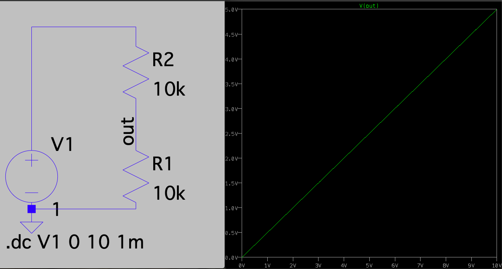

# LTspice® 講座 第2回 シミュレーション

## 1 シミュレーションの種類

### 1.1 よく使う解析

表に解析の一覧(一部)を示します。  
※詳しくはマニュアルへ  
[LTspice® マニュアル 無料ダウンロード (個人情報の登録が必要)](https://www.analog.com/jp/landing-pages/003/ltspice/jp_ltspice_startup.html){:target="_blank"}

|名前|SPICEコマンド|使用方法|
|---|---|---|---|
|AC解析|.ac|.ac oct プロットの間隔 開始周波数 終了周波数|
|DC解析|.dc|.dc 変化させる素子記号 開始電圧 終了電圧 変化間隔|
|過渡解析|.tran|.tran 開始時間 終了時間 保存開始時間 最大ステップ|
|op解析|.op|.op|
|ステップ解析|.step|.step param X list 値1 値2 値3...|
|温度解析|.temp|.temp 温度1 温度2 温度3...|
|フーリエ解析|.four| .four 周波数 測定箇所 |
|値測定|.meas|.meas 解析の種類 変数名 測定方法 測定部分 条件...|

### 1.2 解析の説明
時間の関係で今回つくっていただく解析用の回路はAC解析のみにして,他の解析は事前に作ったものをダウンロードしていただきます。  
ご自由にお使いください。

#### 1.2.1 AC解析

信号源の周波数を変化させて, その時の出力を調べます。  
周波数特性が確認できます。

例


CR回路のAC解析を行い, 周波数特性及び位相特性のグラフが確認できました。  
[AC解析のファイルをダウンロード](5/AC.asc)

#### 1.2.2 DC解析

直流電圧や直流電流を変化させて, その時の出力を調べます。  
静特性が確認できます。

例



電源電圧によりoutの電圧が変化することが確認できます。  
[DC解析のファイルをダウンロード](5/DC.asc)

#### 1.2.3 過渡解析

時間が変化すると回路中の信号がどのように変化するかを調べます。  
オシロスコープのように時間応答が確認できます。

例


入力のパルス波形に対応したコンデンサの充放電電圧のグラフが確認できました。  
[過渡解析のファイルをダウンロード](5/TRAN.asc)

#### 1.2.4 op解析

回路中の直流電圧が確認できます。  
macの場合はRunを押したあと, ⌘(command)+Lを押す必要があります。

例


R1, R2にかかる電圧や流れる電流が確認できました。  
[OP解析のファイルをダウンロード](5/OP.asc)

#### 1.2.5 ステップ解析

特定の値を順に変えていったときの, 回路がどのように動作するかを確認できます。

例


抵抗値が変化すると流れる電流が変化することが確認でました。  
[STEP解析のファイルをダウンロード](5/STEP.asc)

#### 1.2.6 温度解析

トランジスタやダイオードなどの半導体には, 温度特性があります。  
温度が変化した時の特性変化を確認できます。

例


トランジスタの温度特性のグラフが確認できます。  
[温度解析のファイルをダウンロード](5/TEMP.asc)

---

以下は応用的な使い方のため難しい場合はとばしてもよいです。

#### 1.2.7 フーリエ解析
過渡解析の後, 指定した回路のポイントを離散フーリエ変換(DFT)して波形に含まれる周波数成分の大きさ, 波形の歪率などを求めることができます。   
デフォルトでは第9高調波まで算出します。  
結果はwindowsはControl+Lでmacでは⌘(command)+Lで表示されます。  
**※注意** `.option plotwinsize=0` をつけること.  
これは解析結果のデータ圧縮を無効にする効果がある.  
※実際には高速フーリエ変換(FFT)をしています。

離散フーリエ変換の詳しい解説は[Wikipedia](https://ja.wikipedia.org/wiki/%E9%9B%A2%E6%95%A3%E3%83%95%E3%83%BC%E3%83%AA%E3%82%A8%E5%A4%89%E6%8F%9B){:target="_blank"}へ  
全高調波歪の詳しい解説は[Wikipedia](https://ja.wikipedia.org/wiki/%E5%85%A8%E9%AB%98%E8%AA%BF%E6%B3%A2%E6%AD%AA){:target="_blank"}へ

例  


Voutの波形の全高調波歪0.001519[%]が確認できました。  
[フーリエ解析のファイルをダウンロード](5/FOUR.asc)

#### 1.2.8 各種値計算
measコマンドを用いて電流や電圧や利得などの最大値・最小値を取得したり、条件付きでの計算などができます。  
条件式の組み合わせによって、とてもたくさんの種類の計算ができます。  
結果はwindowsはControl+Lで, macは⌘(command)+Lで表示できます。

1種類目の横軸上の1点を指す場合の構文
```
.meas [AC|DC|OP|TRAN|TF|NOISE] <name> [<FIND|DERIV|PARAM> <expr>] [WHEN <expr> | AT=<expr>] [TD=<val1>] [<RISE|FALL|CROSS>=[<count1>|LAST]]
```
例  
##### 1. 消費電力  
`.meas DC iv1 FIND I(V1) AT=0` 0秒時のV1に流れる電流をiv1に入れています。  
`.meas DC denryoku iv1*10` denryokuに電源電圧と電源に流れる電流をかけて入れています。

消費電力は20[mW]であるとわかります。  
[消費電力計算のファイルをダウンロード](5/MEAS_W.asc)

##### 2. 位相余裕
位相余裕とは, 利得が0[dB]の周波数における180°との位相差です。  
  
`180-|-101.755|=78.245°`で, 位相余裕は78.245°と分かります。  
[位相余裕計算のファイルをダウンロード](5/MEAS.asc)


その他のタイプの構文
```
.MEAS [AC|DC|OP|TRAN|TF|NOISE] <name> [<AVG|MAX|MIN|PP|RMS|INTEG> <expr>] [TRIG <lhs1> [[VAL]=]<rhs1>] [TD=<val1>] [<RISE|FALL|CROSS>=<count1>] [TARG <lhs2> [[VAL]=]<rhs2>] [TD=<val2>] [<RISE|FALL|CROSS>=<count2>]
```

## 2 その他のSPICEコマンド (あまり使わない)

その他のSPICEコマンドについて表に示します。 

|SPICEコマンド|説明|
|---|---|
|.model|素子の各値を直接記述できる|
|.param|ユーザー定義パラメータを与えられる|
|.tf|DC小信号伝達関数を見つける|
|.wave|音声ファイル(wavファイル)を実際に入力し, 動作する様子をシミュレーションできる　|

[3回目へ](3.md)
