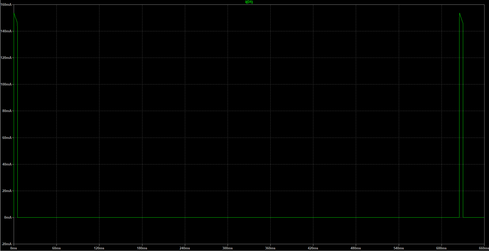

# LTspice® 講座 第3回 Lチカ回路

## 1. Lチカとは
[ニコニコ大百科(仮) Lチカ](https://dic.nicovideo.jp/a/l%E3%83%81%E3%82%AB){:target="_blank"}より引用

> Lチカとは、LEDチカチカの略です。

## 2. Lチカ回路とは
Lチカ回路とはLEDをチカチカ点滅させる回路です。

正式には、**弛張発振回路** (しちょうはっしんかいろ) といいます。  
弛張発振回路とは、電流のオン・オフに対してある条件を与えることで、断続する電気信号を作り出す回路です。

## 3. 回路図


## 4. シミュレーション
### 4.1 部品追加 (LED)
#### windowsの場合
`ドキュメント¥LTspiceXVII¥lib¥cmp¥standard.dio`

#### Macの場合
`~/Library/Application\ Support/LTspice/lib/cmp/standard.dio`

のファイルに, 以下を追記します。

```
.model LED_white D(Is=1e-22 Rs=6 N=1.5 Cjo=50p Xti=100 Iave=100m Vpk=5 mfg=OptoSupply type=LED)
```
<button class="btn-gradient-3d" data-clipboard-text=".model LED_white D(Is=1e-22 Rs=6 N=1.5 Cjo=50p Xti=100 Iave=100m Vpk=5 mfg=OptoSupply type=LED)"> コピー</button>

### 4.2 部品配置
部品を配置し, 素子の値を入力します。  

### 4.3 過渡解析
0~2秒まで過渡解析を行います。

`.tran 0 2 0 1m startup`
<button class="btn-gradient-3d" data-clipboard-text=".tran 0 2 0 1m startup"> コピー</button>

※注意 最後に`startup`をつけないと, 最初から電源が3[V]になっており, C1が充電された状態で始まるため, 正しく解析できなくなってしまいます。

ピンでLEDの電流を確認します。  


拡大すると




グラフより1周期が約0.625[秒]であると分かるため, 発振周波数は以下のようになります。  
 `F = 1/s = 1/0.625 = 1.6 [Hz]`  
よって, この回路は1.6[Hz]で発振していることが分かります。

任意の時間での詳しい値は、グラフの線の名前の部分V(n002)をクリックすると、出てくるカーソルを動かすことで確認できます。


### 4.4 動作原理
1. 電源を入れると10[&mu;s]付近でQ1とQ2のB-E間電圧が動作可能電圧を超えて, Q1とQ2がONになる.

2. C1の充電がはじまる.

3. C1の電圧がD1が発光可能な電圧まで上がったら, D1が点灯する. ※C1は充電中
4. C1の電圧が上がるにつれて, Q2のB電位が圧迫されQ2のB電圧が下がる.
5. Q2のB-E間電圧が動作可能電圧を下回り, Q2とQ1がOFFになり, D1が消灯する.
6. C1が充電中止となり, C1の放電が開始される.
7. C1により圧迫していた電圧が下がるため, Q2のB電位が上昇する.
8. Q2のB-E間電圧が動作可能電圧に達し, Q2がONになる.
9. Q1がONになる.
10. 2へ戻り, 動作が繰り返される.

### 4.5 抵抗変更

発振周波数を変えるために, コンデンサに充電する速度を変えます。  
R1の抵抗の値を変更してみます。

200[k&Omega;] 300[k&Omega;] 400[k&Omega;] でシミュレーションします。


`.step param X list 200k 300k 400k`
<button class="btn-gradient-3d" data-clipboard-text=".step param X list 200k 300k 400k"> コピー</button>


抵抗の値を変更すると, コンデンサの放電速度が変わり, 点滅の時間間隔が変わることが確認できます (緑→青→赤).  
抵抗の値が大きくなると抵抗に流れる電流の値が小さくなるため放電時間が多くかかり, 点滅速度が遅くなることが分かりました。

[4回目へ](4.md)
