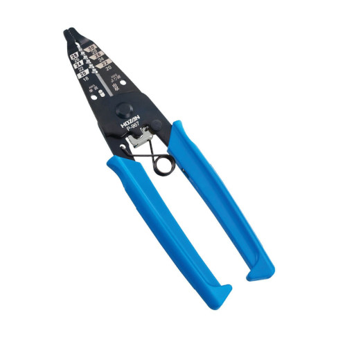

# LTspice® 講座 第4回 回路製作

## 1. 製作準備

### 1.1 使用部品
表に使用する部品の一覧を示す.

|記号|名前|個数|購入場所|値段[円]|
|:-:|---|:-:|:-:|:-:|
|Q1|NPNトランジスタ 2SC1815-Y|1|[秋月電子](http://akizukidenshi.com/catalog/g/gI-04268/){:target="_blank"}|10|
|Q2|PNPトランジスタ 2SA1015-Y|1|[秋月電子](http://akizukidenshi.com/catalog/g/gI-02612/){:target="_blank"}|10|
|D1|LED 黄色 (5mm)|1|[秋月電子](http://akizukidenshi.com/catalog/g/gI-09452/){:target="_blank"}|12|
|R1|1/4[w]炭素皮膜抵抗器 200[k&Omega;]|1|[秋月電子](http://akizukidenshi.com/catalog/g/gR-25204/){:target="_blank"}|1|
|C1|アルミ電解コンデンサ 10[&mu;F] 16[V]|1|[秋月電子](http://akizukidenshi.com/catalog/g/gP-10590/){:target="_blank"}|10|
|V1|単3アルカリ乾電池|2|[秋月電子](http://akizukidenshi.com/catalog/g/gP-10196/){:target="_blank"}|50|
||ユニバーサル基板 45&times;45[mm]|1|[秋月電子](http://akizukidenshi.com/catalog/g/gP-11735/){:target="_blank"}|50|
||半田|適量|||
||導線|適量|||

### 1.2 使用道具

* 半田ごて
* 濡れスポンジ
* 半田ごて台
* ニッパ
* ピンセット
* 半田吸い取り線
* ワイヤーストリッパー

#### 1.2.1 半田ごて
電源を入れ十分熱くなってから使用します。  
コテ先で半田付けする場所(銅色の部分)と部品の線を4秒程度温めます。  
こて先に半田線を2秒ほど軽く押し当て, 半田が全体に流れていくまで溶かします。  
溶けた半田が富士山型になるので, 半田線を離す(半田ごては当てたまま)。  
最後に半田ごてを離します(半田線を離した2秒後くらいに)。

#### 1.2.2 濡れスポンジ
半田付けを行っているとコテ先が黒く汚れてくきます。  
その場合は濡れスポンジで拭き取りコテ先を銀色に保ちましょう。

#### 1.2.3 半田ごて台
半田ごては半田ごて台に置いておきましょう。

#### 1.2.4 ニッパ
半田付け後の不要な導線はニッパで切りましょう。  
後で, 素子同士をつなげるために使用するため残しておきましょう。  
**切るときに線が飛ぶので他の人に当たらないように注意してください**

#### 1.2.5 ピンセット
素子や導線がつかみにくい場合はピンセットを使用します。

#### 1.2.6 半田吸い取り線
半田付けに失敗したら半田吸い取り線を当てながら半田ごてを当てて半田を吸い取ると, 付け直しができます。

#### 1.2.7 ワイヤーストリッパー
被覆付き導線を切り, 被覆を剥きます。

## 2. 製作

### 2.1 部品配置・半田付け
LTspice®で動かない回路は製作しても動きません。  
しかし、LTspice®で動く回路を製作しても必ず動くとは限りません。  
実際に製作してみましょう。

回路図をよく見ながら部品を配置し, 半田付けしてください。  
* 抵抗以外は向きが決まっているため注意すること
* LED(D1)は線が長い方がプラス側
* アルミ電解コンデンサ(C1)は白いラインが入っている方がマイナス側
* Q1, Q2は下から見たときに左からエミッタ(E), コレクタ(C), ベース(B)
* 背の小さな部品から付けていくと付けやすい.

<i class="fas fa-exclamation-triangle fa-3x tyuui"></i>
 火傷に注意
<i class="fas fa-exclamation-triangle fa-3x tyuui"></i>  

回路図

### 2.2 確認

すべてつけ終わったら間違いがないか確認し, 電源を入れてください。  
LEDがチカチカ点滅することを確認してください。

[次へ](5.md)
