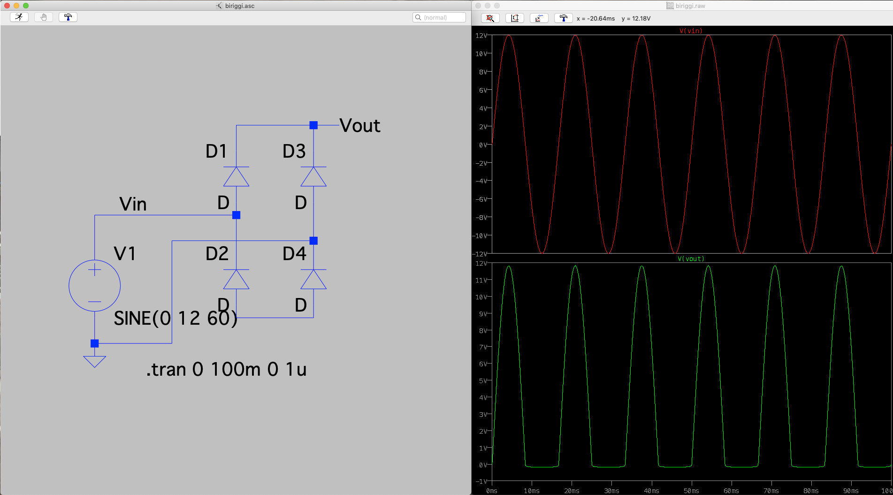
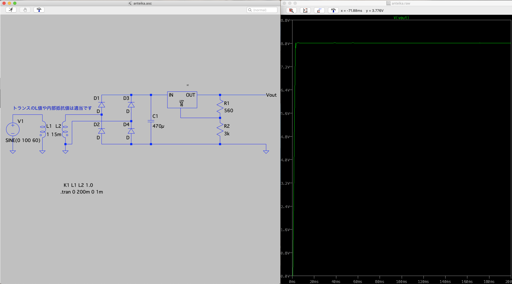

# 要望のあったシミュレーションの例
シミュレーションしてみたいと要望があった回路の簡易的な回路例を掲載するのでぜひ自分でシミュレーションしてみてください。  
シミュレーションに必要な素子などは自分で入れてみてください。

## 1. ブリッジ回路

## 2. ローパスフィルタ

## 3. 安定化電源回路

## 4. FETを使った増幅回路(ソース接地増幅回路)
オペアンプ設計講座にてやります。

## 5. 通信のアナログ基盤
具体的な回路がよく分からなかったです。申し訳ありません。

## 6. ATX電源回路
複雑すぎるので説明を控えさせていただきます。
